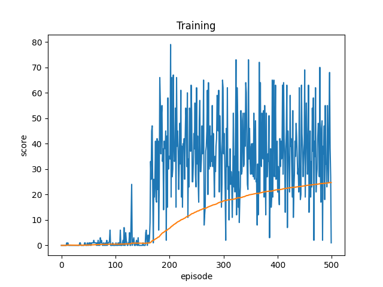
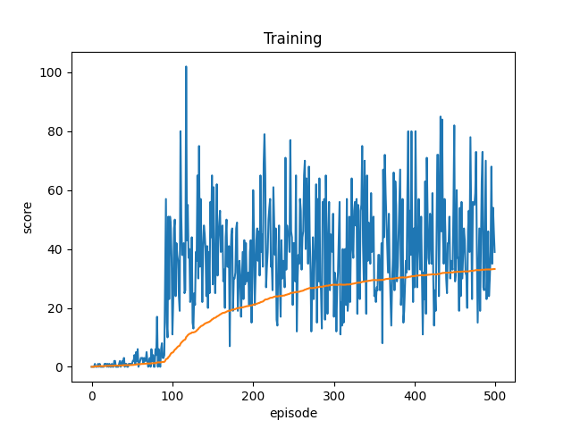
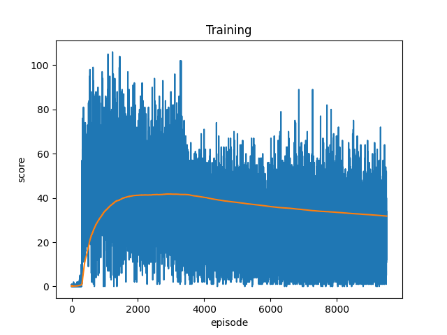
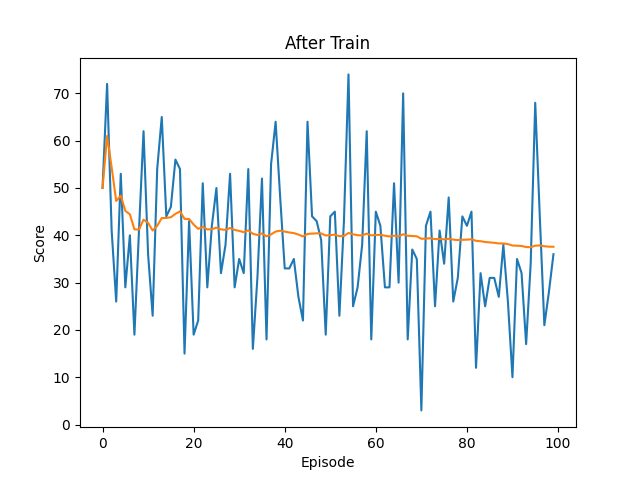
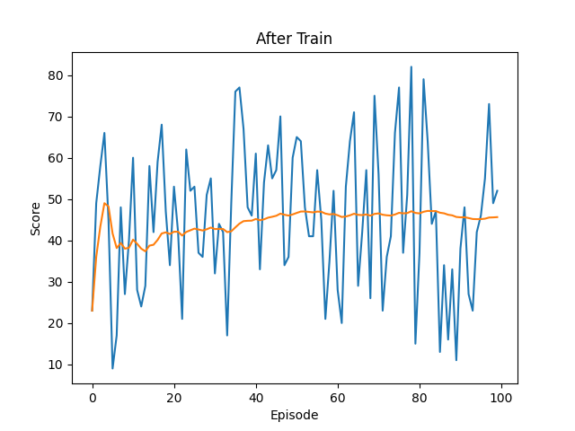
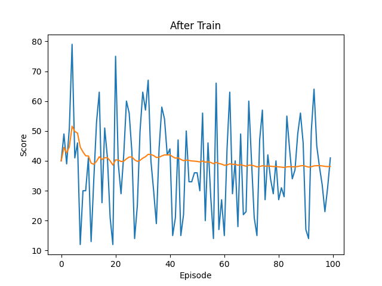

# Snake Game with Deep Q-Learning

This project implements the classic Snake game using the Deep Q-Learning (DQN) algorithm. It includes training, testing, and playing the original game.

---

## Table of Contents

1. [Installation](#installation)
2. [How to Train](#how-to-train)
3. [Training Results](#training-results)
4. [Evaluating the Agent](#evaluating-the-agent)
5. [Acknowledgements](#acknowledgements)

---

## 1. Installation

To get started, ensure you have Python (version 3.6 or higher) installed. Next, install the required dependencies by running the following command:

```bash
pip install -r requirements.txt
```
### To Play the Game Using the Keyboard
Run the following Python file to play the Snake game using your keyboard:
```
python snake_origin.py
```

## 2. How to Train

To start training the agent using Deep Q-Learning, run the train.py file:
```
python agent_trainning.py
```
***Note***: You can adjust training parameters (such as the number of episodes, learning rate, etc.) directly in train.py if needed.
## 3. Training Results

You can get the results as shown in the image below:
<p align="center">    </p>

***Note***: The training results may not be exactly the same, but they should not differ significantly.

## 4. Evaluating the Agent

***To evaluate the performance of the trained agent, run the following Python file:***
```
python run_after_train.py
```

This will show you the agent's performance post-training. The following images depict some of the evaluation results:

<p align="center">    </p>

## 5. Acknowledgements
Thank you for your interest in the Snake Game with Deep Q-Learning project. We hope it provides valuable insights into Deep Reinforcement Learning while offering an entertaining experience.

If you have any feedback, questions, or suggestions for improvement, feel free to open an issue in this repository or contact us directly at: daithai.05042005@gmail.com.

Wishing you success and an enjoyable experience! 🚀

